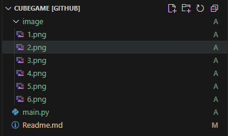
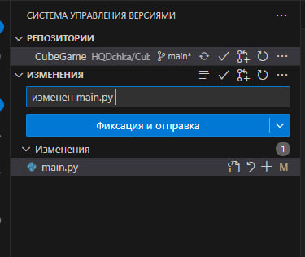
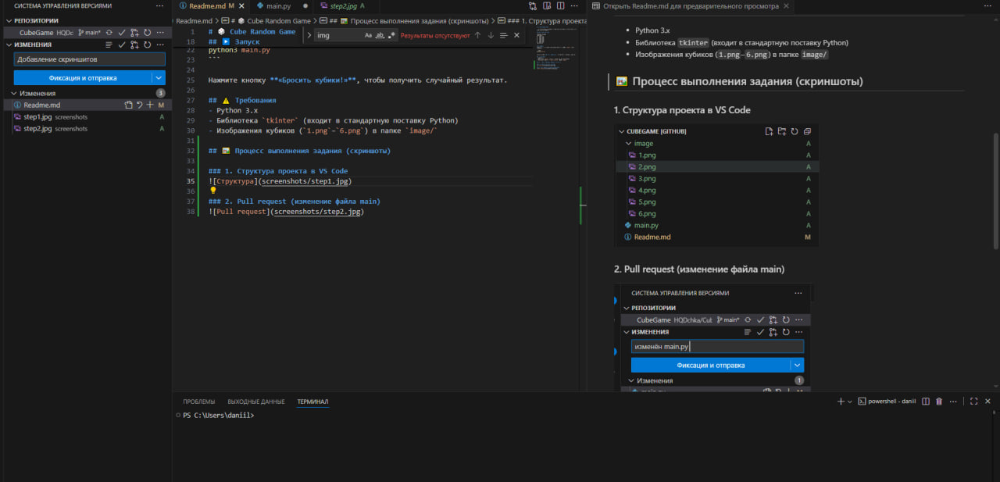

# 🎲 Cube Random Game

Простое приложение на Python с графическим интерфейсом, имитирующее бросок двух игральных кубиков.

## 📁 Структура проекта
```
CUBEGAME [GITHUB]
├── image/
│   ├── 1.png
│   ├── 2.png
│   ├── 3.png
│   ├── 4.png
│   ├── 5.png
│   └── 6.png
└── main.py
```

## ▶️ Запуск
Убедитесь, что все файлы изображений находятся в папке `image/`, затем выполните:

```bash
python3 main.py
```

Нажмите кнопку **«Бросить кубики!»**, чтобы получить случайный результат.

## ⚠️ Требования
- Python 3.x
- Библиотека `tkinter` (входит в стандартную поставку Python)
- Изображения кубиков (`1.png`–`6.png`) в папке `image/`

## 🖼️ Процесс выполнения задания (скриншоты)

### 1. Структура проекта в VS Code


### 2. Pull request (изменение файла main)


### 3. Pull request (изменение Readme и выгрузка скринштов)
